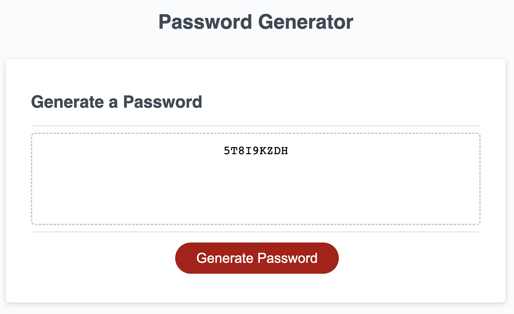

# <Password-Generator>

## Description

This project is a web application that randomly generates passwords based on user-selected criteria (length & character type). Using secure passwords is more important than ever these days, and randomly generated passwords help decrease the risk of hackers guessing your password. This random password generator can be used to help address these security concerns. 

## Installation

This is a web-based application, so all you need is a working we browser. Navigate to this link: _________

## Usage

To use this application, click the "Generate Password" Button. You will receive prompts to enter in the length of your desired password and whether you'd like to include the following characters:
    - uppercase letters
    - lowercase letters
    - numbers
    - special characters

In order for the application to generate a password, the length needs to be between 8 and 128 characters. Additionally, at least one character type needs to be chosen.

## Credits

Starter code by Berkeley Coding Bootcamp

## License

MIT license
